# PAWsome Care

Introducing you a web-app "PAWsome Care", that uses the XAMPP stack; HTML and CSS were used to code the frontend, MySQL for the database, and intergrating Apache and the PHP framework (php.admin) to support the local host, connecting the backend-frontend.

## To Deploy

Install Xampp with apache and MySQL. Initialise tables with init.sql and you're good to go.

## Database Design

### Entity-Relationship Diagram

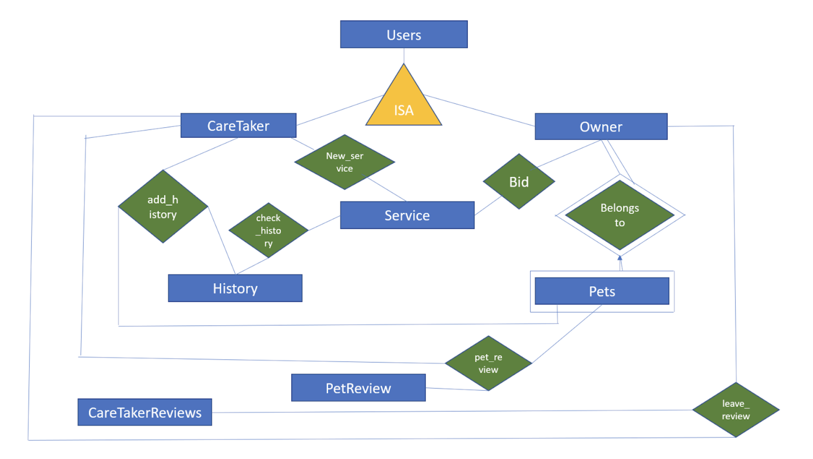

This is a simplified ER diagram with attributes ommitted. Detailed entities and relationships attributes are in the following two sections. Full SQL queries can be found in [init.sql](https://github.com/waisekoh/FinalVersion-PetCare/blob/master/init.sql).

### Entities

##### Users
**Attributes**|**Domain**
:-----|:-----:
UserID (primary key)|INTEGER
display\_name|char(15)
password|char(100)
first\_name|char(45)
last\_name|char(45)
email|char(100)
gENDer|char(1)
phone\_number|INTEGER
address|char(100)
country|char(100)
age|INTEGER

##### Owner
**Attributes**|**Domain**
:-----:|:-----:
oid (references Users(UserID))|INTEGER

##### Caretaker
**Attributes**|**Domain**
:-----:|:-----:
cid (references Users(UserID))|INTEGER

##### Pets
**Attributes**|**Domain**
:-----|:-----:
pid (primary key)|INTEGER
pet\_name|char(100)
pet\_type|char(100)
oid (references Owner(oid))|INTEGER

##### Service
**Attributes**|**Domain**
:-----|:-----:
sid (primary key)|INTEGER
cid (references CareTaker(cid))|INTEGER
oid (references Owner(oid))|INTEGER
stype|TEXT
ptype|TEXT
minbid|INTEGER
pid (references Pets(pid))|INTEGER
fromdate|TEXT
todate|TEXT
availability|boolean
completed|boolean

##### History
**Attributes**|**Domain**
:-----|:-----:
cid (references Service(cid))|INTEGER
sid (references Service(sid))|INTEGER
pid (references Service(pid))|INTEGER
name|TEXT

##### CareTakerReviews
**Attributes**|**Domain**
:-----|:-----:
crid (primary key)|INTEGER
review|TEXT
cid (references CareTaker(cid))|INTEGER
rid (references Owner(oid))|INTEGER

##### PetReview
**Attributes**|**Domain**
:-----|:-----:
prid (primary key)|INTEGER
review|TEXT
pid (references Pets(pid))|INTEGER
cid (references CareTaker(cid))|INTEGER

### Relationships

##### Bid
**Attributes**|**Domain**
:-----:|:-----:
bid\_in|INTEGER

##### New_service
**Attributes**|**Domain**
:-----|:-----:
minbid\_in|INTEGER
fromdate\_in|DATE
todate\_in|DATE

##### Add_history
**Attributes**|**Domain**
:-----:|:-----:
sid|INTEGER

##### Check_history
**Attributes**|**Domain**
:-----:|:-----:
check\_id|INTEGER

##### Pet_review
**Attributes**|**Domain**
:-----:|:-----:
review\_in|char varying

##### Leave_review
**Attributes**|**Domain**
:-----:|:-----:
review\_in|char varying

## Webpage Design

### Signing up for a PAWsome Care account

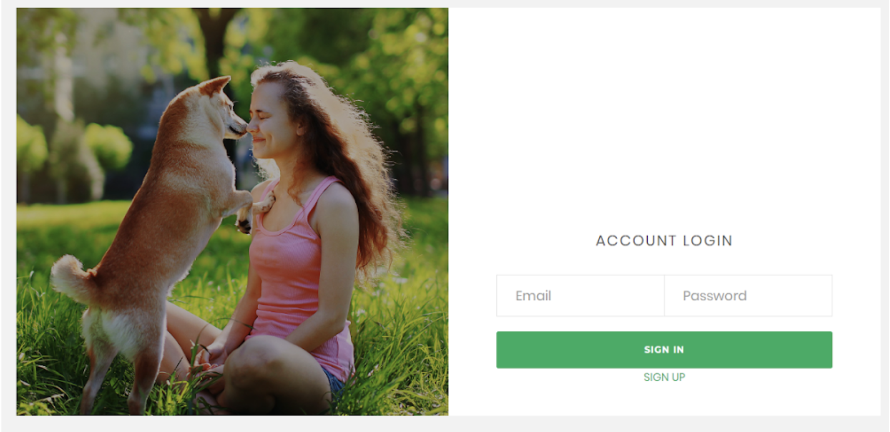

Step 1: Click on sign-up button on the log-in page

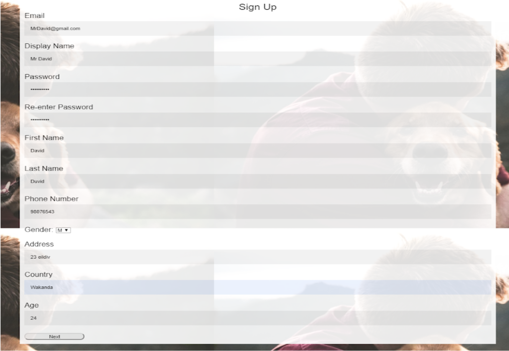

Step 2: The sign-up button will link users to the sign-up page where they can fill in their particulars

Step 3: Users then have to choose to sign up as a caretaker or a pet owner

Step 4: Users will be directed to the log-in page upon successful sign up

##### Upon successful sign-up and log-in, caretakers can choose to publish a new service and owners can choose to register a new pet profile.

### Caretakers POV

Step 1: This will be shown if caretakers have not published a service 

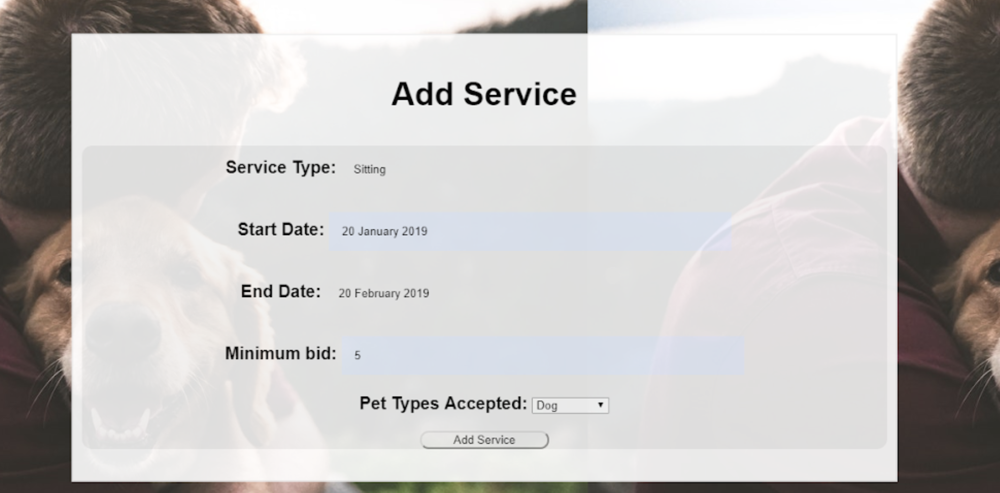

Step 2: Upon pressing the “add service” button, caretaker will be linked to the fill in the service information provided

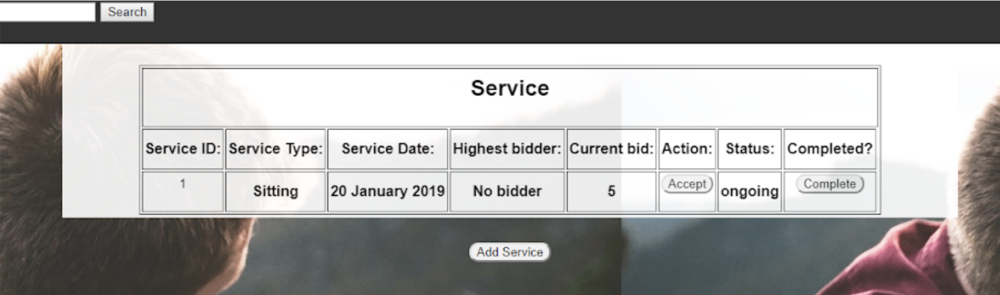

Step 3: Once the service is added, the service will be published on the caretaker’s profile, where he/she can accept the highest bidder if there is any.

### Owners POV

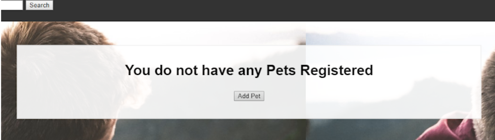

Step 1: This will be displayed to the owners if they have not registered a pet profile.

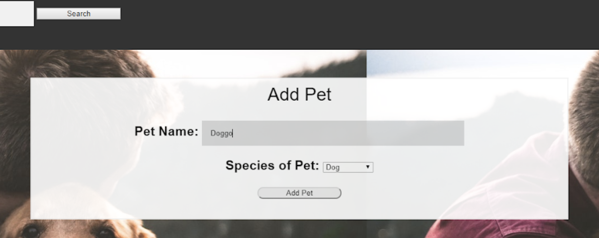

Step 2: Upon clicking “add pet” button, owners will be lead to the registration page to fill in their pet’s particulars

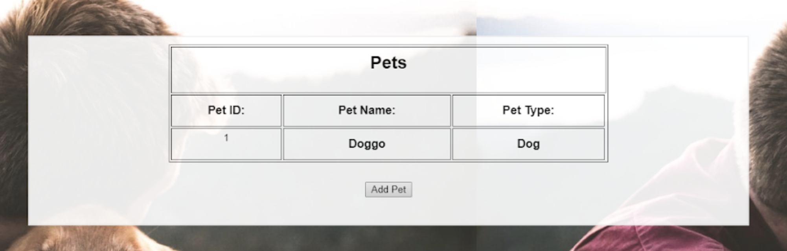

Step 3: Once pet profile is successfully created, it will be reflected on the owner’s profile page

 
## Owners bidding for a caretaker’s service

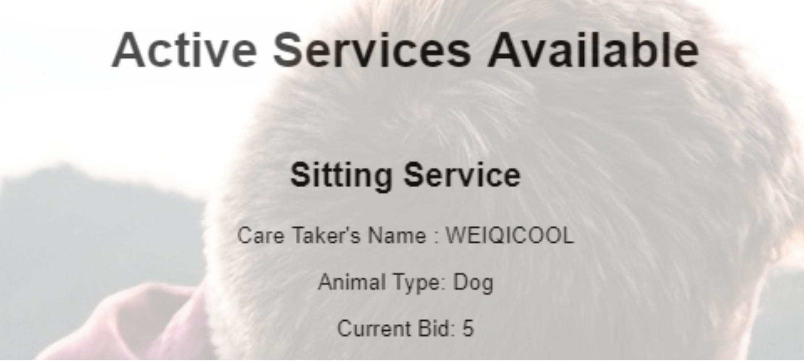

Step 1: This is displayed to the owners when there are new services published by caretakers, it is shown on the left side of the page upon clicking on the “services” tab on the header

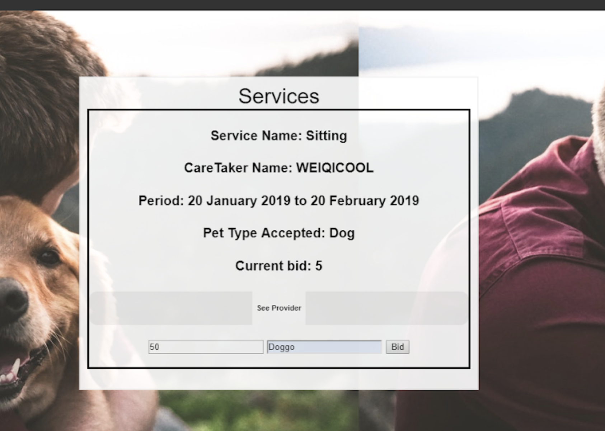 

Step 2: Upon clicking on the service, the owner can choose to enter in their bid point. (Note that the bid point entered must be higher than the current bid point)

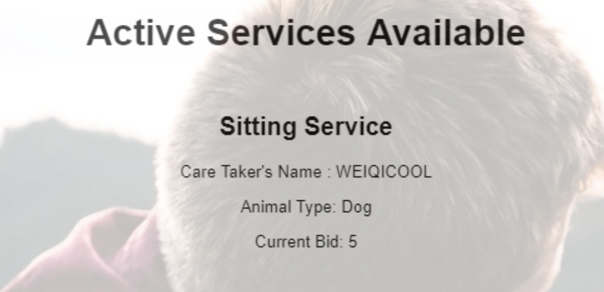

Step 3: Once the bid is placed, the current highest bid point will be reflected on the published service for the owner to view

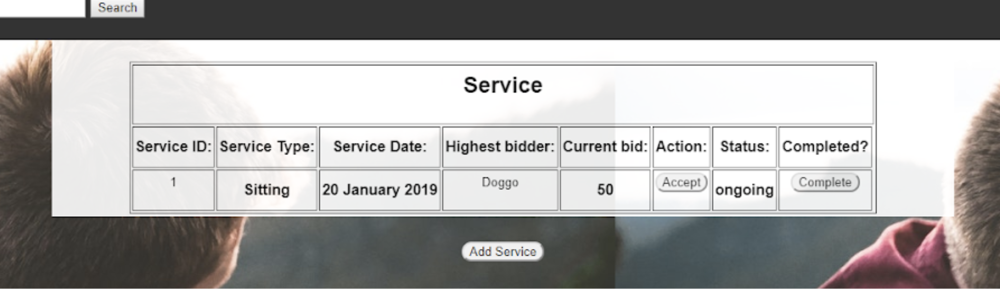

Step 4: Once there is a bidder, the caretaker can see the current highest bid under his profile and choose to accept/ignore it. Note that the status is in the “ongoing” state before any acceptance is done.

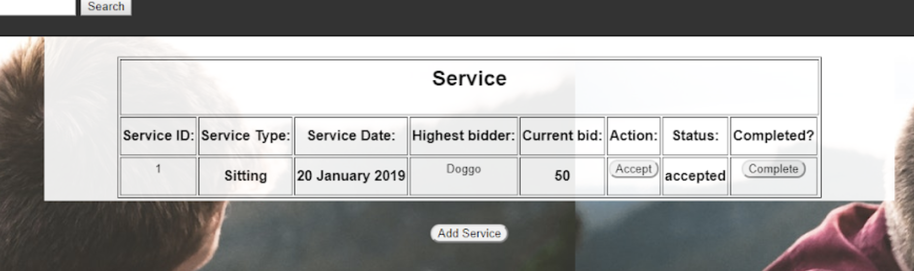

Step 5: When the caretaker accepts the bid, the status will be changed to “accepted”.

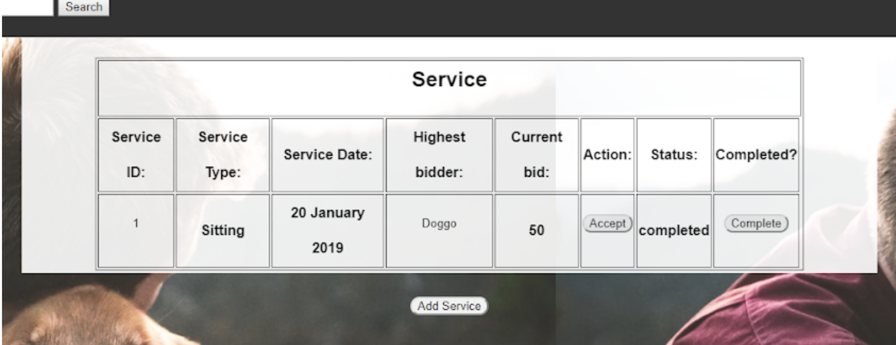

Step 6: Upon completion of the service, caretaker has to update the service’s completion status to “completed”.

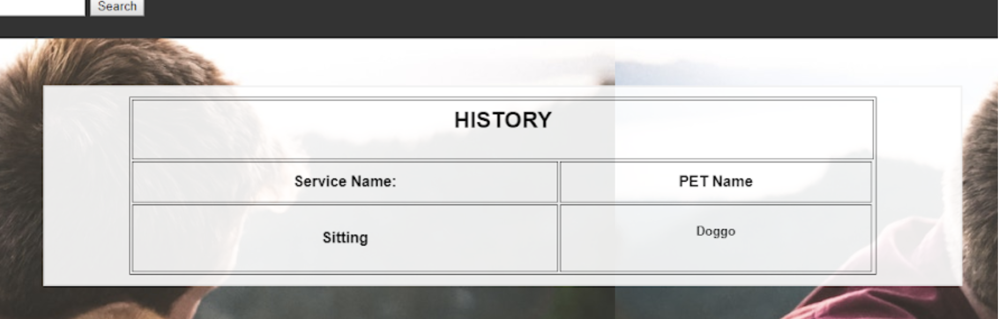

Step 7: Only after the whole process demonstrated above, this service will then be stored in the history of the caretaker as a record.

## Convenient search function via the search bar for any users

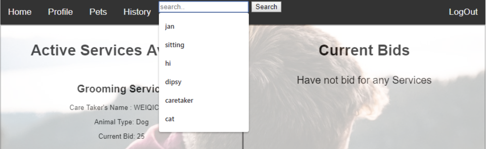

### Example 1 - Owner wants to find a service for his pet dog, hence she decided to type in the key word “dog”

Step 1: Search bar is found on the header where users can use any keywords to search for any requirements.

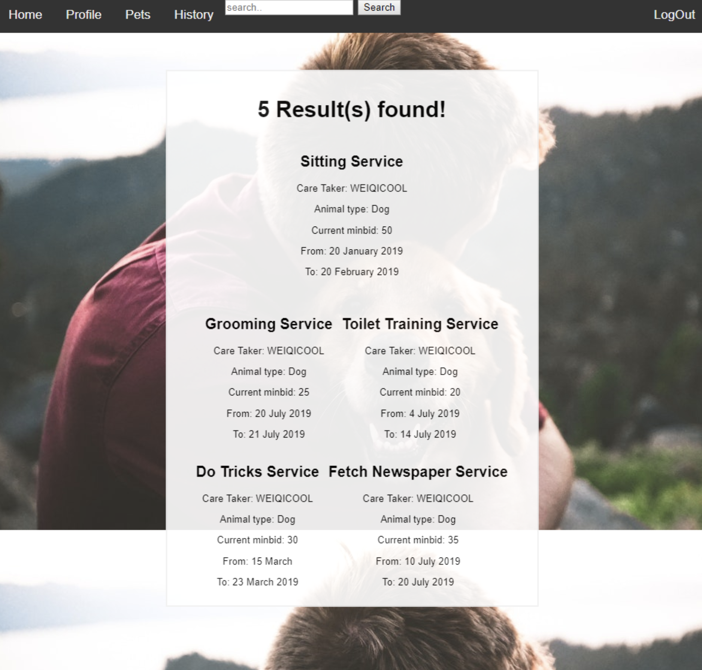

Step 2: Upon pressing the search button, it will link the owner to the page of search results related to dogs. In this case, there are 5 results in total.

###. Example 2 - Owner wants to search for a service in a particular month

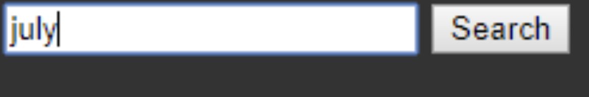

Step 1: Type in “July” as keyword in the search bar.

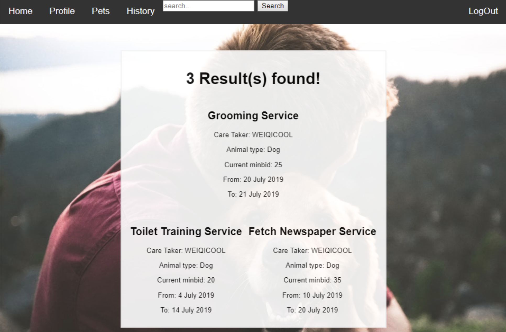

Step 2: Upon clicking the search button, 3 search results are shown and they are all services required during the July period only.

